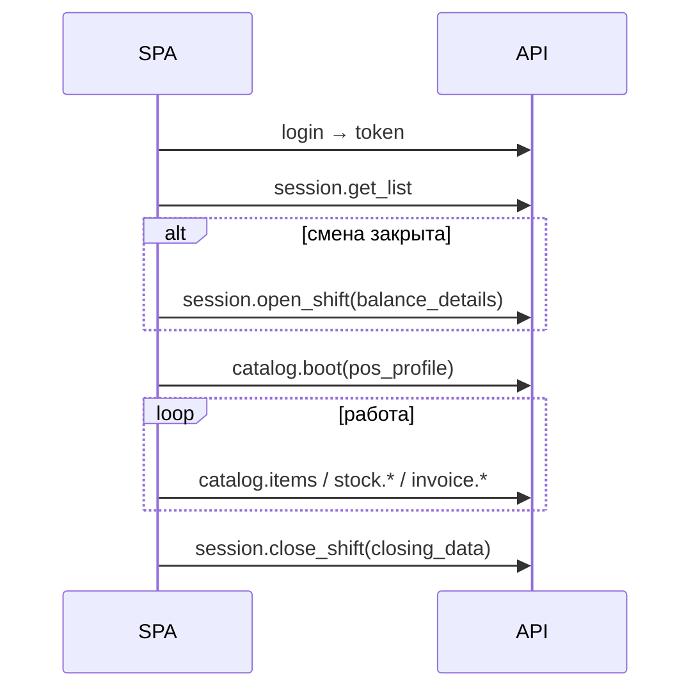

# Fadl POS SPA — интеграция с бэкендом (промпт для фронта)

Используй этот документ как единый источник правды при миграции POS SPA на новый RPC-контракт fadl_pos.

---

## 1. Что изменилось (breaking)

| Было | Стало |
|------|--------|
| Один endpoint + `action=...` (`customer.get`, `catalog.get`, `invoice.sync`, …) | **Отдельный** `/api/method/` на каждую операцию |
| Смешанные форматы ответа | Ответы проходят **Pydantic Out** на границе API (предсказуемые поля) |
| `payment_methods` с `mop_type` и др. | Только **`{"name": "<Mode of Payment>"}`** |
| `balance_details` в boot с `mop_type` | **`mode_of_payment`**, `opening_amount`, `default`, `allow_in_returns` |
| Двойная сериализация на клиенте не нужна | Сервисы отдают сырые dict; **валидация только в whitelist** |

Старые combined-endpoints **удалены**. Таблица замен: `docs/SPA_RPC_MIGRATION.md`.

---

## 2. Как вызывать API

### Базовый URL

```
POST|GET https://{site}/api/method/{dotted.python.path}
```

Пример: `fadl_pos.api.catalog.boot` →  
`https://my.site/api/method/fadl_pos.api.catalog.boot`

### Заголовки (обязательно)

```http
Accept: application/json
Content-Type: application/json
Authorization: <token из login>
```

- **`token`** приходит в `message.token` после `login` / `login_qr` (строка вида `Basic <base64(api_key:api_secret)>`).
- Клади её **целиком** в `Authorization` — cookie `sid` для POS API **не используем**.

### Тело запроса

- **Только `application/json`**.
- Вложенные структуры — **нативные JSON-массивы/объекты**, не `JSON.stringify` отдельных полей.
- Параметры — **на верхнем уровне** тела (как kwargs Frappe whitelist), не обёртка `{ "args": ... }` (если не используешь низкоуровневый SDK с `args`).

### Ответ Frappe

```json
{
  "message": { ... полезная нагрузка ... },
  "exc": "...",
  "_server_messages": "..."
}
```

Работай с **`response.message`**. Ошибки валидации входа → HTTP **417** + текст в `exc` / `_server_messages`.

### Frappe JS SDK

```javascript
frappe.call({
  method: "fadl_pos.api.catalog.boot",
  args: { pos_profile: "Main POS" },
  headers: { Authorization: token },
});
```

SDK кладёт `method` в URL и **не** шлёт `cmd` в body — так и задумано.

### fetch (без Desk)

```javascript
const res = await fetch(`${site}/api/method/fadl_pos.api.catalog.boot`, {
  method: "POST",
  headers: {
    Accept: "application/json",
    "Content-Type": "application/json",
    Authorization: token,
  },
  body: JSON.stringify({ pos_profile: "Main POS" }),
});
const { message } = await res.json();
```

---

## 3. Авторизация

| Операция | Method path | Guest | Body |
|----------|-------------|-------|------|
| Логин пароль | `fadl_pos.api.login.login_endpoints.login` | да | `{ usr, pwd }` |
| Логин QR | `fadl_pos.api.login.login_endpoints.login_qr` | да | `{ encrypted_qr, pin_code }` |
| Сброс сессий / ротация ключей | `fadl_pos.api.login.login_endpoints.clear_sessions` | нет | — |
| Генерация QR | `fadl_pos.api.login.login_endpoints.generate_qr` | нет | `{ pin_code }` |

Ответ логина: `{ token: "Basic ..." }` в `message`.

---

## 4. Смена POS (session)

### 4.1 Список профилей — `fadl_pos.api.session.get_list`

- **GET или POST**, без параметров.
- Ответ: `message` — **массив** из одного блока `{ pos_profiles: [...] }`.

**Смена открыта:** в `pos_profiles` **ровно один** профиль:

```json
{
  "name": "Main POS",
  "status": "Open",
  "company": "...",
  "opening_entry": "POS-OPE-...",
  "opening_entry_date": "..."
}
```

Без `payment_methods` / `checklists`.

**Смена закрыта:** все доступные профили со `status: "Close"`:

```json
{
  "name": "Main POS",
  "status": "Close",
  "company": "...",
  "opening_entry": null,
  "payment_methods": [{ "name": "Cash" }],
  "checklists": [{ "opening": [{ "title": "..." }], "closing": [...] }]
}
```

`payment_methods` — **только** способы с флагом **Required Opening Balance** в Desk. Поле **`name`** = Mode of Payment (то же имя в `balance_details` / `closing_data`).

### 4.2 Открыть смену — `fadl_pos.api.session.open_shift` (POST)

```json
{
  "pos_profile": "Main POS",
  "company": "My Company",
  "balance_details": [
    { "name": "Cash", "opening_amount": 500 }
  ],
  "comment": ""
}
```

- `balance_details` — **массив объектов** (не строка JSON).
- Суммы только для `name` из `get_list` → `payment_methods`; лишние `name` **игнорируются**.
- На документ попадают **все** способы профиля; неуказанные обязательные → ошибка; остальные → `0`.
- `company` пока **обязателен** (дублирует company профиля).
- Ответ: как `get_list` (массив с одним открытым профилем).

### 4.3 Закрыть смену — `fadl_pos.api.session.close_shift` (POST)

```json
{
  "opening_entry_name": "POS-OPE-2026-00001",
  "closing_data": [
    { "name": "Cash", "closing_amount": 480 }
  ],
  "comment": ""
}
```

- `closing_data` — массив или опустить / `[]` если нет обязательных MOP.
- Ответ:

```json
{
  "status": "success",
  "closing_entry": "POS-CLS-...",
  "is_final": true,
  "entry_status": "Submitted",
  "error_message": null
}
```

### 4.4 Boot после открытия — `fadl_pos.api.catalog.boot` (POST)

```json
{ "pos_profile": "Main POS" }
```

Вызывать **после** успешного `open_shift`, когда есть открытый POS Opening Entry.

Ответ `message`:

| Ключ | Смысл |
|------|--------|
| `opening_voucher` | текущий opening: `name`, `period_start_date`, `user_full_name`, `balance_details[]` |
| `pos_profile` | поля POS Profile + вложенный `customer` (если задан) |
| `precision` | `currency`, `float`, `rounding_method`, `number_format` |
| `item_groups` | `{ tree: [...] }` |
| `warehouses` | список складов компании |
| `checklists` | `{ opening: [{title}], closing: [...] }` |
| `taxes` | `[{ title, taxes: [...] }]` |

В `balance_details` boot: **`mode_of_payment`** (не `name`), плюс `opening_amount`, `default`, `allow_in_returns`.

---

## 5. Каталог

### `fadl_pos.api.catalog.items`

```json
{
  "start": 0,
  "page_length": 15,
  "price_list": null,
  "item_group": null,
  "pos_profile": "Main POS",
  "search_term": ""
}
```

Ответ: `{ items: [ { name, item_name, uom, actual_qty, price_list_rate, uoms, ... } ] }`.

При `search_term` — поиск/скан (один или несколько items).

---

## 6. Склад (stock)

| Path | Ключевые параметры | Ответ (message) |
|------|-------------------|-----------------|
| `fadl_pos.api.stock.single` | `item_code`, `warehouse` | `{ item_code, warehouse, actual_qty }` |
| `fadl_pos.api.stock.batch` | `item_codes: string[]`, `warehouse` | `{ stocks: [{ item_code, actual_qty }] }` |
| `fadl_pos.api.stock.warehouses` | `company` или `pos_profile` | `{ warehouses: [...] }` |
| `fadl_pos.api.stock.bundle` | `item_code`, `warehouse` | `{ bundle_availability }` |
| `fadl_pos.api.stock.auto_serial` | `qty`, `item_code`, `warehouse`, `batch_nos?` | `{ serial_nos: [] }` |
| `fadl_pos.api.stock.reserved_serials` | `item_code`, `warehouse` | `{ reserved_serial_nos: [] }` |
| `fadl_pos.api.stock.update_warehouse` | `pos_profile`, `warehouse` | `{ status, message, warehouse? }` |

---

## 7. Клиенты (customer)

| Path | Параметры |
|------|-----------|
| `fadl_pos.api.customer.list_customers` | `search_term?`, `limit?` (default 10, max 100) |
| `fadl_pos.api.customer.details` | `customer` (id) |
| `fadl_pos.api.customer.recent_transactions` | `customer` |
| `fadl_pos.api.customer.create` | **POST** `data` — **строка JSON** документа Customer |
| `fadl_pos.api.customer.update` | **POST** `data` — **строка JSON** (обязательно `name`) |
| `fadl_pos.api.customer.set_info` | **POST** `fieldname`, `customer`, `value` |

Ответы: `customers[]`, `{ customer }`, `{ transactions }`, `{ status, customer?, message? }`.

---

## 8. Оплаты и лояльность (payment)

| Path | Body |
|------|------|
| `fadl_pos.api.payment.update_invoice_payments` | `{ invoice_name, payments: [{ mode_of_payment, amount, ... }] }` — **payments массив**, не строка |
| `fadl_pos.api.payment.validate_coupon` | `{ coupon_code }` |
| `fadl_pos.api.payment.get_loyalty_details` | `{ customer, posting_date? }` |

---

## 9. Счета (invoice)

Все **POST**. Поле **`data`** — **строка** с JSON документа (POS Invoice / Sales Invoice), не вложенный объект в корне:

```json
{
  "data": "{\"doctype\":\"POS Invoice\",\"items\":[...],\"customer\":\"...\"}"
}
```

| Path | Назначение |
|------|------------|
| `fadl_pos.api.invoice.save` | черновик create/update |
| `fadl_pos.api.invoice.submit` | save + submit |
| `fadl_pos.api.invoice.return_invoice` | возврат (`return_against` в data) |
| `fadl_pos.api.invoice.void` | cancel/delete |
| `fadl_pos.api.invoice.validate_cart` | префлайт остатков: в `data` нужны `items[]` + `warehouse` |

`validate_cart` → `{ valid, errors[], warnings[] }`.

Остальные → `{ status, name, invoice?, message? }`.

**Не доверяй** клиентским `grand_total`, `amount` на строках — сервер пересчитывает.

---

## 10. Прочее

| Path | Параметры |
|------|-----------|
| `fadl_pos.api.invoice_list.history` | `search_term?`, `status?` (default `"Paid"`), `limit?` |
| `fadl_pos.api.offers.active` | `pos_profile?` |
| `fadl_pos.api.offers.coupons` | `customer?` |
| `fadl_pos.api.offers.apply` | **POST** `invoice_name`, `coupon_code?` |

---

## 11. Валидация и ошибки

- Неизвестные поля в строгих In-моделях → **417** (`extra=forbid`).
- `customer.create` / `update` и поля invoice — **`extra=allow`** внутри JSON в `data`.
- Пустой `pos_profile` / `customer` / `warehouse` где required → 417.
- Бизнес-ошибки ERPNext → 417/500 с `_server_messages`.

---

## 12. Рекомендуемый порядок экранов



---

## 13. Чеклист миграции фронта

- [ ] Убрать все `action` из запросов.
- [ ] Обновить base path на новые `fadl_pos.api.*` методы (таблица в `SPA_RPC_MIGRATION.md`).
- [ ] Везде `Authorization: token`, `Content-Type: application/json`.
- [ ] `payments`, `item_codes`, `balance_details`, `closing_data` — как **массивы** в JSON.
- [ ] Session: `payment_methods[].name` ↔ `balance_details[].name` / `closing_data[].name`.
- [ ] Убрать использование `mop_type`.
- [ ] Invoice/customer create/update: поле `data` как **строка JSON**.
- [ ] Обработка 417 для неверных полей.
- [ ] Boot только после открытой смены.

---

## 14. OpenAPI

Частичная спецификация: `docs/openapi-fadl-pos.yaml` (login + session). Остальные path — по таблицам выше; при расхождении приоритет у **кода** `fadl_pos/api/*.py` и `schemas/input.py` / `output.py`.

---

*Версия контракта: fadl_pos RPC boundary (один method = одна операция, dump только в whitelist).*
